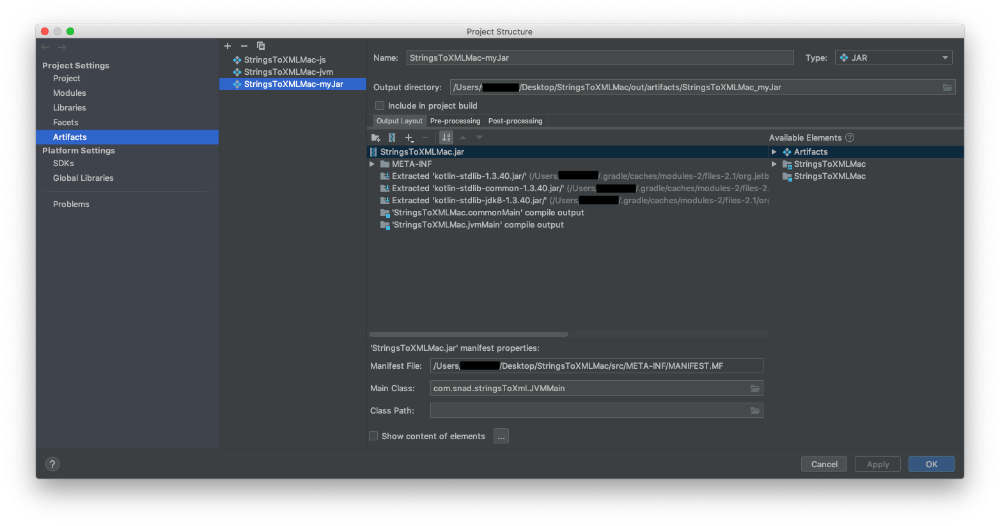

# StringsToXML

   

StringsToXML is an application to convert translated strings into an Android compatible XML format. 

Many hobbyist Android developers use spreadsheets to manage their app translations. In order to import translated string into Android Studio, developers have to create a `strings.xml` file for each language. With StringsToXML it is possible, to copy and paste translated strings and their respective IDs, and save them as an XML file.


## About

This app was made using `Kotlin Native` version `1.3` to create a native `macOS client` and a `Java client`, which runs on Win/Mac/Linux. StringsToXML utilizes Kotlin Natives approach to place buisness logic into a common module, which is shared between all platforms. UI code and other platform specific features are implemented seperately.

## Download

#### Version 1.0

- macOS 10.10+: StringsToXML.app
- Java (Win/Mac/Linux): StringsToXML.jar
- Source: Release 1.0

## Usage

- Copy the IDs column from your spreadsheet into the left textfield
- Copy the strings column from your spreadsheet into the right textfield
- Choose `Preview` to see how your XML file will look like
- Choose `Save` to save the generated XML file

#### Example:
```
IDs:                Strings:        
            
app_title           StringsToXML
button_save         Save
button_preview      Preview
```
#### Result:
```
<?xml version="1.0" encoding="UTF-8" standalone="no"?>
<resources>
    <string name="app_title">StringsToXML</string>
    <string name="button_save">Save</string>
    <string name="button_preview">Preview</string>
</resources>
```

## Building

### MacOS
1. Open the project folder in IntelliJ IDEA
2. Open the Gradle Tab on the right and run the task: `Tasks -> build -> linkDebugFrameworkMacos`
    
    The apple framework will be built into `build/bin/macos/debugFramework/StringsToXMLKt.framework`. The Xcode project is already configured to use the framework in this location.
3. Open the Xcode project in `StringsToXML/StringsToXML.xcodeproj`
4. Build and run the app in Xcode

### Java

1. Open the project folder in IntelliJ IDEA
2. Go to `File -> Project Structure -> Artifacts`
3. Choose the `StringsToXMLMac-MyJar` entry and add the dependencies shown in the image below
    
    >NOTE: This is a workaround, since I wasn't able to build a fat jar (which includes kotlin dependencies) with the given gradle tasks. The three kotlin dependencies shown in the image: `stdlib`, `stdlib-common` and `stdlib-jdk8` are in a cache folder, which is the reason why they have to be removed and replaced with the path to your specific cache folder.
    The path should be `/Users/username/.gradle/caches/modules-2/files-2.1/org.jetbrains.kotlin/kotlin-stdlib-.../1.3.40/randomNumber/kotlin-stdlib-....jar`.
    Choose the folder which contains the file **without** 'sources' at the end of the name.

    
4. Click apply and ok
5. Choose `Build -> Build Artifacts... -> StringsToXMLMac-myJar -> Build` to build the jar file.
6. Run the jar file at `out/artifacts/StringsToXMLMac_myJar/StringsToXMLMac.jar`

## License

```
StringsToXML
Copyright © 2019 SNAD

This program is free software: you can redistribute it and/or modify
it under the terms of the GNU General Public License as published by
the Free Software Foundation, either version 3 of the License, or
(at your option) any later version.

This program is distributed in the hope that it will be useful,
but WITHOUT ANY WARRANTY; without even the implied warranty of
MERCHANTABILITY or FITNESS FOR A PARTICULAR PURPOSE.  See the
GNU General Public License for more details.

You should have received a copy of the GNU General Public License
along with this program.  If not, see <https://www.gnu.org/licenses/>.
```
See [LICENSE](LICENSE.md) to read the full text.